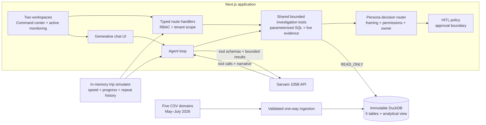
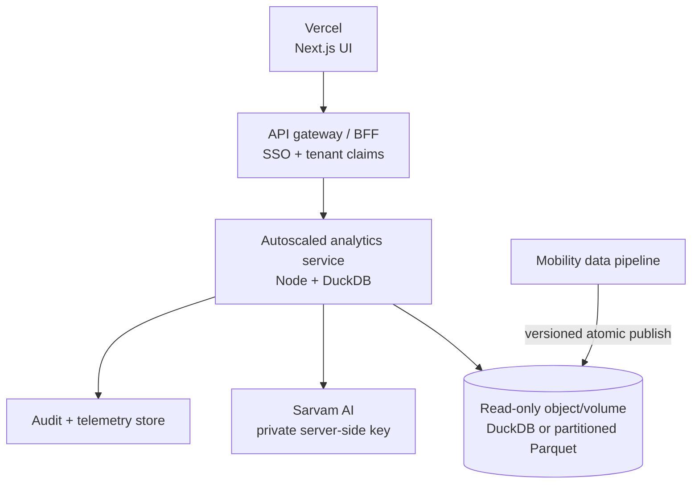

# Architecture

## Request path

1. The persona switch and filters define business-unit, period, office, and optional vendor scope.
2. `/api/dashboard` executes independent aggregate queries in parallel and redacts fields not allowed for the persona.
3. `/api/trips/{businessUnit}/{tripId}` resolves the tenant-safe composite key and excludes rider or billing sections according to persona.
4. `/api/monitoring` advances in-memory telemetry; `/api/monitoring/classify` sends threshold candidates to Sarvam for forced structured decision tool calls.
5. `/api/agent` exposes one shared, persona-bounded investigation core. A question may combine live simulation evidence with historical DuckDB evidence—for example, a live driver incident followed by the vendor's three-month OTA trend.
6. Sarvam chooses the narrowest tool; the server validates arguments, executes the bounded operation, redacts persona-restricted fields, and returns compact evidence.
7. Persona routing converts the shared evidence into an Operational Incident, Strategic Decision Brief, or Readiness Alert. Consequential actions are proposals until the responsible human approves them.
8. The model writes at most three short sentences: finding, relevant context/why, and one owned action. Tool syntax, raw JSON, and evidence dumps are never rendered. Compact evidence UI appears only when the user explicitly asks to show, list, compare, chart, or break down data.

## Why this is agentic

The model does not generate SQL or merely paraphrase the screen. It senses a signal, investigates the correct entity and metric, checks a relevant threshold/history/peer baseline and alternative explanation, then proposes a persona-owned action. OTA is compared with its 90% SLA; speeding is compared with road limits and driver/vehicle patterns—never with OTA. The tool loop supports several calls when a question crosses live and historical evidence.

## Persona and HITL policy

- **Transport Manager — Operational Incident:** named driver/route/trip pattern, operational why, and an approval-aware intervention.
- **Transport & Facilities Head — Strategic Decision Brief:** systemic trend, SLA/peer/cost evidence, recommendation, and approve/reject ownership; no individual-event dump.
- **Team / Line Manager — Readiness Alert:** affected workforce/shift/route scope, expected impact, and team action; no billing or vendor-spend evidence.

Low-risk sensing, investigation, monitoring, and informational recommendations can proceed automatically. Driver escalation, stopping a trip, route/schedule changes, vendor allocation, notifications, and strategic actions remain human-gated according to persona policy.

## Live safety investigation

Sarvam classifies speed candidates into distinct reasons: isolated breach, repeated moderate speeding, persistent driver pattern, extreme speed, or possible telemetry anomaly. It receives current excess, recent readings, driver/vehicle/vendor history, route, shift, and data-quality context. The structured result contains severity, reason, confidence, human owner, approval requirement, and one action. Repeated events are consolidated into the latest active incident per trip in the default UI.

For a scheduled production agent, run the same tools on a cadence and persist only trigger state outside the immutable evidence database. Example triggers:

- OTA drops more than five points versus the prior period.
- A vendor is below SLA for three consecutive shifts.
- Sev-1 volume or acknowledgement time crosses policy.
- A shift's late/no-show exposure threatens a staffing threshold.
- Cost per trip rises while service quality falls.

## Scale and multi-tenancy

- Always include `business_unit` in indexes, joins, caches, and authorization scope.
- Pre-aggregate each many-side domain before joining to avoid fan-out errors.
- Cache dashboard aggregates for 60 seconds; do not cache rider-level responses across tenants.
- At larger history, partition source Parquet by tenant/month and let DuckDB scan only required partitions, or move the same semantic layer to a warehouse.
- Keep LLM inputs to small analytical result sets. Never send raw million-row tables to the model.
- Record tool name, validated arguments, row count, latency, persona, tenant, and model usage in an audit log outside the source tables.

## Production deployment shape

This separates the fast, globally cached UI from a stateful analytical workload and avoids putting a large native database inside each serverless cold start.
